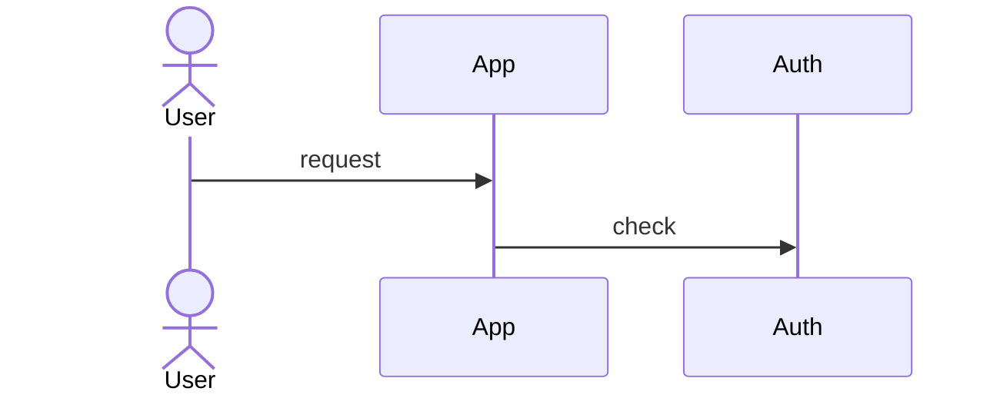

# Note templates

Fill every generated section. Mermaid is required on project notes (sequence
when there is a flow; flowchart otherwise). No screenshots, no canvas files.

## Wikilinks

| From | To | Link |
|------|----|------|
| Project note | Sibling feature | `[[Canonical]]` |
| Project note | Pattern | `[[patterns/Canonical]]` |
| Pattern / home / catalog | Project feature | `[[projects/<slug>/Canonical]]` |
| Anywhere | Pattern | `[[patterns/Canonical]]` |

Filenames = canonical name + `.md` (spaces allowed). Title = canonical name.

## Frontmatter

### Project feature

```yaml
---
type: project-feature
canonical: Impersonation
project: ore-max
status: active
aliases: []
depends_on:
  - Auth
related: []
sources:
  - src/admin/impersonate.ts
repo_path: /abs/path/to/repo
updated: YYYY-MM-DD
---
```

`status`: `active` | `stale`. `sources`: key files only, not every coverage
path. `depends_on` / `related`: canonical names.

### Pattern

```yaml
---
type: pattern
canonical: Impersonation
status: active
aliases: [login-as, act-as]
projects: [ore-max]
updated: YYYY-MM-DD
---
```

### Project index

```yaml
---
type: project-index
slug: ore-max
repo_path: /abs/path/to/repo
updated: YYYY-MM-DD
---
```

## Project note body (order is required)

````markdown
# Impersonation

## What it is

3–8 sentences. What the user or operator can do. Not a file list.

## How it works

User/operator flow in prose.

## Sequence



## Connections

- **Depends on:** [[Auth]]
- **Unlocks:**
- **Related:** [[patterns/Impersonation]]

## Surfaces

Routes, UI entry points, APIs.

## Implementation map

| Path | Role |
|------|------|
| src/admin/impersonate.ts | Starts impersonation session |

## Data and config

Models, tables, env keys (**names only**, never values).

## Gotchas

Leapfrog gold: edge cases, coupling, “don’t copy this”.

## Port to a new app

1. **Prerequisites** — other features that must exist first
2. **Stack assumptions** — framework, auth, db this recipe expects
3. **Recreate** — files/concepts to build, in order
4. **Env** — variable *names*
5. **Verify** — how you know it works
6. **Do not copy** — repo-specific hacks

## Human notes
````

Empty Human notes: leave the heading and a blank line.

## Pattern note body

```markdown
# Impersonation

Portable definition (what the capability *is*, not how one repo did it).

## Across projects

| Project | How they do it | Worth stealing | Caveats | Note |
|---------|----------------|----------------|---------|------|
| ore-max | … | … | … | [[projects/ore-max/Impersonation]] |

## Default recipe

Best of what is in the vault when starting fresh. Point at the project note
to copy from.

## Aliases

From the catalog.

## Human notes
```

First sighting: one table row; default recipe can match that project’s port
section. Later runs: add/update the row; rewrite default recipe if a better
implementation appeared.

## Indexes

### `projects/<slug>/Index.md`

````markdown
# ore-max

## Stack

| Vendor | Role | Why it matters | Where |
|--------|------|----------------|-------|
| Stripe | Payments | All paid plans | `src/lib/stripe.ts`, `STRIPE_SECRET_KEY` |
| Neon | Database | Source of truth | `drizzle.config.ts`, `DATABASE_URL` |
| Clerk | Auth | Identity | `src/middleware.ts` |
| Vercel | Hosting | Production | `vercel.json` |
| Resend | Email | Receipts and magic links | `src/lib/email.ts` |
| Next.js | Framework | App runtime | `package.json` |

## Features

- [[Auth]]
- [[Billing]]

### Stale

- [[Old Thing]]

## Human notes
````

Omit `### Stale` when none. Incomplete without `## Stack`.

### Stack rules

One table, this Index only. Not a feature, not a catalog row, not `stack/`
notes. No confirmation pause; corrections go in `## Human notes`.

**Row** = a named product you would tell another engineer this app runs on
(Stripe, Neon, Clerk, Vercel, Next.js). Direct and load-bearing, with
evidence in the repo.

**Order** = how dead the product is if that row vanishes tomorrow. Rank
*this* app, not a generic web stack (a payments product lists Stripe above
Vercel; a brochure lists Vercel above Stripe). Row order is the rank — no
number column.

**Columns**

| Column | Content |
|--------|---------|
| Vendor | Product name as sold (Stripe, not `stripe-js`) |
| Role | Short noun for the job: Hosting, Database, Auth, Payments, Email, Search, Storage, Jobs, Analytics, Observability, CMS, Flags, Framework, Media, SMS, AI, … |
| Why it matters | One clause about **this** product, not “it’s the database” |
| Where | 1–3 paths or env **names** (never values) |

**Include:** hosted platforms, databases, identity/payments/email/search/
storage/jobs providers, the app framework/runtime, analytics/observability
that are actually wired.

**Omit:** linters, formatters, test runners, type packages, UI primitives,
utility libraries, transitives, local-only tooling, editors, generic git/npm.
Do not dump `package.json`. Do not rank alphabetically or by manifest order.

**Evidence:** direct dependencies, deploy config (`vercel.json`,
`wrangler.toml`, `fly.toml`, `railway.toml`, `docker-compose*.yml`), ORM
adapters, env *names* in examples, README/VISION vendor names the **code**
uses. Do not invent vendors.

**Same role, two vendors:** two rows; heavier use first.

**Empty table:** only if there is no framework and no third party. If
`package.json` names Next.js, that is a row.

### Other indexes

**`patterns/Index.md`** — all canonical patterns.

**Vault `Index.md`** — link each project index + pattern index + catalog.
Keep the intro line; replace the “no projects” placeholder once any exist.

## Re-run

### Project feature / pattern

1. Read the existing note (if any).
2. Capture from `## Human notes` through EOF (exact heading). If missing,
   captured body is empty.
3. **`status: active` and still present:** rewrite frontmatter + generated
   sections 1–9 from current code; append `## Human notes` + captured body.
4. **Gone from this inventory:** set `status: stale`, bump `updated`, add a
   one-line stale callout if not already present, **keep** the previous
   generated sections (do not invent a new flow from empty evidence); keep
   Human notes.
5. Do not delete the file. Do not merge Human notes into generated sections.

### Project index

1. Capture from `## Human notes` through EOF.
2. Rewrite frontmatter, `## Stack`, and `## Features` from current evidence.
3. Append Human notes. Do not delete the file.

Anything the user wrote *above* `## Human notes` is generated and will be
replaced. Point that out in the first-run handoff once.
